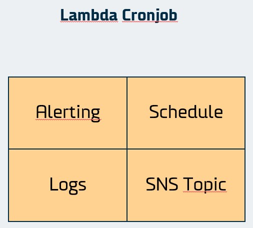

# Introduction

This module spins up the infrastructure for a cronjob on aws lambda. Included is a Cloudwatch log, an SNS topic, an EventBridge rule, as well as glue to permissions to make the components work together. Finally the module spins up another lambda function which listens for specific words in the logs.



## How to use

```hcl
module <entity_name> {
  source        = "github.com/dfds-data/terraform-modules/modules/lambda_cronjob"
  entity_name   = <entity_name> # The entity name defines the name of all the resources that are spun up. A set of random letters is appended to the end of the resource names.
  image_uri = <image_uri> # This image can be anything for now. It will be ignored in subsequent runs of terraform apply. The image should updated in the CI/CD pipeline.
  monitor_image_uri = <monitor_image_uri> # This image must contain a function that reads an event and posts the message to a webhook url. Per default it listens to the 'ERROR' and 'timeout' words in the logs of the cronjob. This can be changed by specifying the 'filterpattern' argument.
  webhook_url = var.webhook_url # The url of the webhook
}
```

In the CI/CD pipeline you will want to specify the schedule and attach the policies that it might need.

## Update configuration

```aws
aws events put-rule --name <function_name> --schedule-expression <cron_expression>
```
