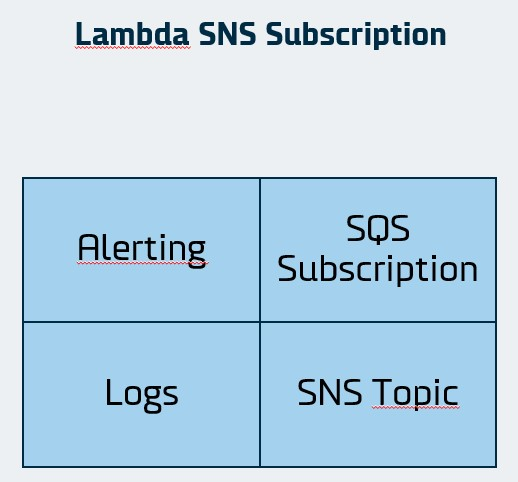

# Introduction

This module spins up the infrastructure for an SNS subscription on aws lambda. Included is a Cloudwatch log, an SNS topic, and permissions to make the components work together. The module also spins up an SQS queue that subscribes to the SNS topic and an event source mapping from the SQS queue to the lambda function. Finally the module spins up another lambda function which listens for specific words in the logs.



# How to use

```hcl
module <entity_name> {
  source        = "github.com/dfds-data/terraform-modules/modules/lambda_cronjob"
  entity_name   = <entity_name>
  image_uri = <image_uri> # This image can be anything for now. It will be ignored in subsequent runs of terraform apply. The image should updated in the CI/CD pipeline.
  monitor_image_uri = <monitor_image_uri> # This image must contain a function that reads an event and posts the message to a webhook url. Per default it listens to the 'ERROR' and 'timeout' words in the logs of the cronjob. This can be changed by specifying the 'filterpattern' argument.
  webhook_url = var.webhook_url
  sns_topic_arn = module.<entity_name>.topic_arn # SNS topic arn to listen to (Typically another [lambda_cronjob](https://github.com/dfds-data/terraform-modules/tree/main/modules/lambda_cronjob) or [lambda_sns_subscription](https://github.com/dfds-data/terraform-modules/tree/main/modules/lambda_sns_subscription) module in the same terraform project).
}
```
